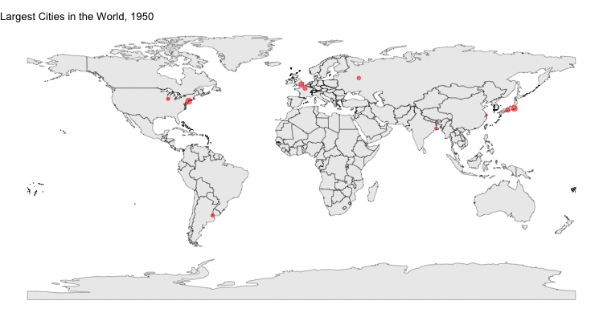

```{r, include = FALSE}
knitr::opts_chunk$set(
  collapse = TRUE,
  comment = "#>"
)
```

```{r setup}
library(historicalBorders)
```

`historicalBorders` is an R package for producing visualizations of historical maps. Utilizing the `sf` and `ggplot2` packages, `historicalBorders` allows users to plot data over historical borders, from the 1800s until today. Maps are available in 50-year increments, built off of the [\`historic-basemaps\`](https://github.com/aourednik/historical-basemaps) repo.

## Base Maps

To plot the whole world at a given point in time, a user can use the `mapWorld` function, specifying a certain year:

```{r}
mapWorld(1800)
```

If a user gives a year that is not included in the dataset, the function will display the map from the closest year:

```{r}
mapWorld(1875)
```

## Visualizing Region Options

The `optionsRegions()` function allows users to see a data frame display of regions within a specified continent by inputting`optionsRegions(["continent"])`:

```{r}
optionsRegions("Africa")
```

## Visualizing Year Options

To visualize the years available to choose from, users can call the `optionsYears()` function:

```{r}
optionsYears()
```

## Mapping Continents

If a user only wants to visualize a certain continent, they can do so by choosing a `map[Continent]` function:

```{r}
mapAsia(1900)
```

Six options are available:

-   `mapNorthAmerica()`

-   `mapSouthAmerica()`

-   `mapEurope()`

-   `mapAfrica()`

-   `mapAsia()`

-   `mapOceania()`

## Mapping Regions

To plot a region of the world, users can use the `mapRegion()` function to map a region on a given year with `mapRegion([year],["region"])`:

```{r}
mapRegion(1825, "Eastern Europe")
```

## Mapping Countries

If a user wants to visualize a specific country at a specified time, they can input the year and country name to the function `mapCountry()`to give a map of that country's borders. The user should input `mapCountry([year], ["country name"])`:

```{r}
mapCountry(1900, "United States")
```

## Custom Mapping

If a user wants to only visualize a certain area of the world, they can visualize a custom area using coordinate pairs. The function `mapCustom()` will map a given are on a given year by `mapCustom([year], [pair of latitudes], [pair of longitudes])`:

```{r}
mapCustom(1900, c(20, 65), c(15, 45))
```

# random animated :p

library(animation)

```{r, message=FALSE}
library(animation)

years <- unique(citiesPop$YEAR)

years <- years[years > 1900]

plots = c()

ani.options(res = 900)

saveGIF({
  for(year in years){
    plot <- mapWorld(year) + 
      geom_point(data = filter(citiesPop, YEAR == year), 
                 aes(x = LONG, y = LAT, size = POP, alpha = .5), color = 'red') +
      labs(title = paste0("Largest Cities in the World, ", year)) +
      theme(legend.position = "none") +
      scale_size_continuous(limits = c(4288091, 41913860))
    print(plot)
  }
}, interval = .75, movie.name="test.gif", ani.width = 750, ani.height = 400)

```


